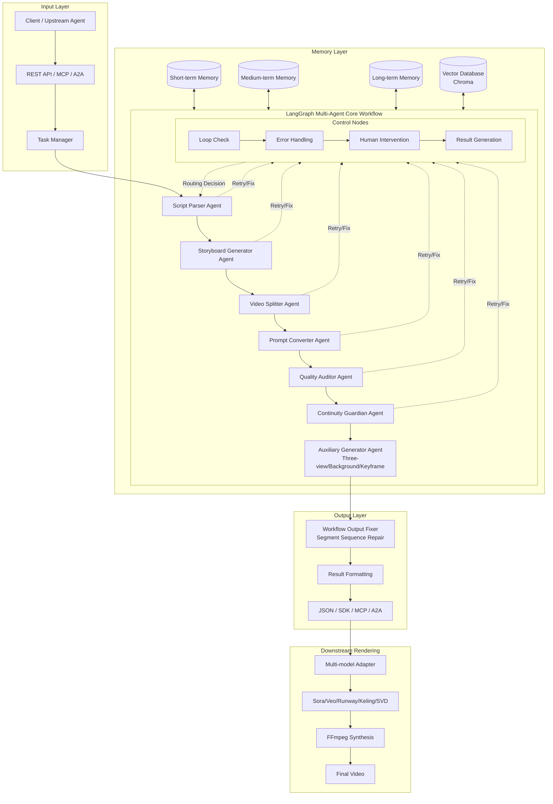

# PenShot：Script → Storyboard → AI Video Prompt

A multi-agent collaborative screenplay storyboarding system that splits scripts in various formats into script units optimized for AI text-to-video generation durations. It outputs high-quality storyboard fragment descriptions while ensuring narrative continuity. Built on LangChain and LangGraph, the system leverages LLMs to parse any script format into "Text-to-Video" prompt fragments compatible with mainstream AI video models. It supports task pool priority queuing, multi-level memory management, and Chroma vector retrieval.

> **One-Click Conversion**: Any screenplay format → Shot-level descriptions → Sora/Veo/Runway/Kling-ready prompts  
> **Continuity Guaranteed**: Multi-level memory + vector retrieval ensures character/scene/plot consistency across shots  
> **Get Started in 5 Minutes**: `pip install penshot` + 3 lines of code

[中文](./README_zh.md) | English | [Documentation](https://pengline.cn/2026/02/7e6cd67dd5ee45248f2276ac145555f5/) | [PyPI](https://pypi.org/project/penshot/)  | [WebSite](https://shot.pengline.cn) |  [RAG Knowledge](https://pengline.cn/2026/04/1e7f1f2a5a184427b4711cc7c1903027/) · [MCP Service](https://pengline.cn/2026/02/b027d930c0b84ba6abd24bbef7d78afc/)

[](LICENSE) [](https://www.python.org/) [](https://langchain-ai.github.io/langgraph/) [](https://pypi.org/project/penshot/) [](https://pepy.tech/project/penshot)

**From Story to Shot** - Transform your scripts into AI-powered storyboards.

> Named "penshot" on PyPI - because every story starts with a pen.


---

## Why PenShot?

| Pain Point                                              | PenShot Solution                                             |
| ------------------------------------------------------- | ------------------------------------------------------------ |
| Scripts too long for AI video models                    | Smart chunking + precise duration planning for model-friendly fragments |
| Character outfit changes / scene jumps break continuity | Multi-level memory + Chroma vector retrieval auto-maintains context |
| Manual prompt engineering is time-consuming             | Auto-generates bilingual visual descriptions + negative prompts + audio cues |
| Complex multi-model adaptation                          | One codebase, supports OpenAI/Qwen/DeepSeek/Ollama & more    |


---

## Core Features

| Feature | Description |
|---|---|
| Intelligent Script Parsing | Automatically identifies scenes, dialogue, and action cues; understands narrative structure; supports long-text chunking. |
| Precise Temporal Planning | Intelligently segments content at the shot level, allocating optimal durations that strictly comply with AI video model constraints. |
| Continuity Guard | Leverages task pool priority queuing, multi-level memory (short/mid/long-term), and Chroma vector retrieval to ensure high consistency in character states, scenes, and plot across adjacent shots. |
| High-Quality Prompt Output | Generates detailed bilingual (Chinese/English) visual descriptions, negative prompts, and audio prompts, ready for immediate use. |
| Multi-Model Compatibility | Supports OpenAI, Qwen, DeepSeek, Ollama, and other major LLM providers with plug-and-play switching. |
| Multi-Protocol Integration | Provides Python SDK, REST API, LangGraph nodes, A2A collaboration protocol, and standard MCP interfaces. |
| Robustness & Traceability | Built-in auto-retry and error fallback mechanisms. Every storyboard fragment is bidirectionally traceable to its original script location. |


---

## System Architecture & Workflow



This system is a typical Natural Language Processing (NLP) application that achieves end-to-end storyboard transcoding through multi-agent collaboration and memory mechanisms. For detailed architectural design, memory pool implementation, and continuity assurance, please refer to: [Architecture Design & Implementation](https://pengline.cn/2026/02/7e6cd67dd5ee45248f2276ac145555f5/)


------

## Quick Start

### 1. Environment Setup

```bash
# Install via PyPI
pip install penshot
```

> Note: `penshot` is the PyPI package name, while `story-shot-agent` is the GitHub repository name. Both refer to the same project.

### 2. Configuration

```bash
cp .env.example .env
```

Edit the `.env` file to configure the required LLM and Embedding parameters:

```properties
########################## LLM Configuration #########################
PENSHOT_LLM__DEFAULT__BASE_URL=https://api.openai.com/v1
PENSHOT_LLM__DEFAULT__API_KEY=sk-xxxxxxxxxxxxxxxxxxxxxxxxxxxxxxxxxxxxxxxx
PENSHOT_LLM__DEFAULT__MODEL_NAME=gpt-4o
PENSHOT_LLM__DEFAULT__TIMEOUT=30

########################## Embedding Model Configuration #########################
PENSHOT_EMBED__DEFAULT__BASE_URL=https://api.openai.com/v1
PENSHOT_EMBED__DEFAULT__API_KEY=sk-xxxxxxxxxxxxxxxxxxxxxxxxxxxxxxxxxxxxxxxx
PENSHOT_EMBED__DEFAULT__MODEL_NAME=text-embedding-v4

########################## Redis Configuration ##########################
PENSHOT_REDIS_URL=redis://:123456@localhost:6379/0
```

### 3.Usage Methods

#### 1. Python SDK

```python
from penshot.api import create_penshot_agent

agent = create_penshot_agent(max_concurrent=5)

script = "Morning, a girl reading in a cafe, sunlight streaming through the window..."
task_id = agent.breakdown_script_async(
    script,
    callback=lambda r: print(f"Task {r.task_id} completed")
)

status = agent.get_task_status(task_id)
result = await agent.wait_for_result_async(task_id)
```

Full example: [direct_usage.py](https://github.com/neopen/story-shot-agent/blob/main/example/direct_usage.py)

#### 2. FastAPI Web Application Integration

Integrate into existing systems via standard HTTP endpoints:

```python
from fastapi import FastAPI, HTTPException
from penshot.api import create_penshot_agent

app = FastAPI(title="Penshot API", version="0.1.0")
agent = create_penshot_agent(max_concurrent=5)

@app.post("/api/generate")
async def generate(script_text: str):
    task_id = agent.breakdown_script_async(script_text)
    return {"task_id": task_id, "status": "PENDING"}
```

Full example: [web_app.py](https://github.com/neopen/story-shot-agent/blob/main/example/web_app.py)

#### 3. LangGraph Node Integration

Can be embedded as an independent node in LangChain/LangGraph workflows for end-to-end automation. Full example: [langgraph_integration.py](https://github.com/neopen/story-shot-agent/blob/main/example/langgraph_integration.py)

#### 4. A2A Protocol Collaboration

Supports context passing and task orchestration with upstream scriptwriting agents and downstream text-to-video/editing agents. Full example: [a2a_integration.py](https://github.com/neopen/story-shot-agent/blob/main/example/a2a_integration.py)

#### 5. MCP (Model Context Protocol) Support

Start the MCP Server:

```bash
python -m penshot.mcp_server --max-concurrent 5 --queue-size 500
```

Clients can call the `breakdown_script` and `get_task_result` tools to seamlessly integrate with MCP-compatible IDEs or agent frameworks. Full example: [mcp_client.py](https://github.com/neopen/story-shot-agent/blob/main/example/mcp_client.py)


------

## Output Data Structure

The system returns standardized JSON containing video prompts, negative prompts, duration estimates, style parameters, and accompanying audio prompts:

```json
{
  "fragments": [
    {
      "fragment_id": "frag_001",
      "prompt": "Cinematic wide shot: midnight 11 PM in a compact urban apartment living room...",
      "negative_prompt": "cartoon, anime, 3D render, bright lighting, text, watermark...",
      "duration": 4.2,
      "model": "runway_gen2",
      "style": "cinematic 35mm film, moody realism, shallow depth of field...",
      "audio_prompt": {
        "audio_id": "audio_001",
        "prompt": "Low-frequency rain ambience (intensity 0.95), distant muffled TV static...",
        "model_type": "AudioLDM_3",
        "audio_style": "cinematic"
      }
    }
  ]
}
```


------

## System Notes & Considerations

| Category              | Description                                                  |
| --------------------- | ------------------------------------------------------------ |
| Network Dependency    | Requires stable access to external LLM APIs. Proxy or domestic mirrors are recommended. |
| Long Text Processing  | For extremely long scripts, segmented input is advised. The system includes built-in context memory and RAG mechanisms. |
| Generation Duration   | AI video models may output clips with ±10% duration variance, which is industry-standard. |
| Multilingual Support  | Currently optimized for Chinese scripts. Support for other languages is under active iteration. |
| Audio Synchronization | Audio prompts are provided. Lip-sync and environmental sound fusion require downstream tooling. |
| Error Handling        | Auto-retry and fallback mechanisms are built-in. Extreme edge cases may require manual intervention. |


------

## Development Roadmap

### Short-Term

- Optimize long-shot segmentation logic for action continuity
- Implement consistency validators for character clothing, positioning, and props
- Specialized prompt format adaptation for Sora, Pika, and other models
- Hybrid architecture combining rule-based engines and LLMs
- Full English script support and intelligent node failure fallback
- Fragment confidence scoring and debug mode (intermediate result persistence)

### Mid-Term

- Advanced camera language support (pan, tilt, zoom, tracking, follow)
- Emotion-driven automatic visual style adjustment
- Ultra-long script chunking + vector DB context memory
- Multi-script batch queue processing & Web visualization interface
- Character/scene reference image integration & multi-format export (XML/EDL/JSON)

### Long-Term

- Multimodal input (image + audio + text hybrid)
- Real-time low-resolution preview & automatic continuity repair
- Professional editing software plugins (Premiere/FCP/DaVinci)
- Multi-user collaboration, version control, & autonomous learning from feedback
- Bidirectional script-fragment traceability, semantic alignment detection, & multi-round correction mechanisms

### Ultimate Goal

Achieve zero-information-loss visualization for scripts of any length, language, or genre, delivering a standardized workflow that meets professional director-level storyboarding standards. The system will feature customizable styles, full traceability, automatic optimization loops, and cross-modal high consistency.


------

## Contributing

We welcome contributions via Issues or Pull Requests:

- **Bug Reports:** Please provide reproduction steps, environment details, and error logs.
- **Feature Requests:** Use the `enhancement` label.
- **Code Optimization:** Performance tuning, architectural refactoring, or adding test cases.
- **Documentation:** Translations, example additions, or technical corrections.

Quick dev environment setup:

```bash
git clone https://github.com/neopen/story-shot-agent.git
cd story-shot-agent
pip install -e ".[dev]"
pytest tests/
```


------

## License

This project is licensed under the MIT License. See the [LICENSE](https://chat.qwen.ai/c/LICENSE) file for details. Copyright (c) 2025 HiPeng


------

## Contact

- Project Homepage: https://github.com/neopen/story-shot-agent
- Documentation: https://pengline.cn/2026/02/7e6cd67dd5ee45248f2276ac145555f5/

Special thanks to LangChain, LangGraph, Chroma, Ollama, and the open-source community for their technical support. If this project has been helpful to your work, please consider starring the repository and sharing your feedback.