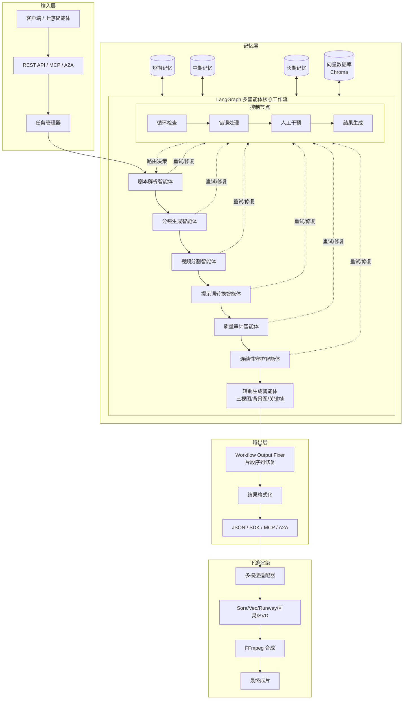

# 剧本分镜智能体 (Penshot)

一个基于多智能体协作的剧本分镜系统，能够将多种格式的剧本拆分为符合 AI 文生视频时长的脚本单元，输出高质量分镜片段描述，并保证叙事连续性。系统基于 LangChain + LangGraph 构建，通过 LLM 将任意格式剧本解析转换为符合主流模型的“Text to Video”提示词片段，支持任务池优先级排队、多层级记忆管理与 Chroma 向量检索。

中文 | [English](./docs/README-en.md) | [架构文档](https://pengline.cn/2026/02/7e6cd67dd5ee45248f2276ac145555f5/) | [PyPI](https://pypi.org/project/penshot/)

[](LICENSE) [](https://www.python.org/) [](https://langchain-ai.github.io/langgraph/) [](https://pypi.org/project/penshot/) [](https://pepy.tech/project/penshot)

------


## 核心功能

| 特性             | 说明                                                         |
| ---------------- | ------------------------------------------------------------ |
| 智能剧本解析     | 自动识别场景、对话和动作指令，理解故事结构，支持长文本分段处理 |
| 精准时序规划     | 按镜头粒度智能切分内容，分配合理时长，严格适配 AI 视频生成模型的时长限制 |
| 连续性守护       | 基于任务池优先级排队、多层级记忆（短期/中期/长期）与 Chroma 向量检索，确保相邻分镜间角色状态、场景和情节高度一致 |
| 高质量提示词输出 | 生成详细的中英双语画面描述、负面提示词及音频提示词，开箱即用 |
| 多模型兼容       | 支持 OpenAI、Qwen、DeepSeek、Ollama 等主流 LLM 提供商，可插拔切换 |
| 多协议集成       | 提供 Python SDK、REST API、LangGraph 节点、A2A 协作协议与 MCP 标准接口 |
| 健壮性与可追溯   | 内置自动重试、错误降级机制，每个分镜片段均可双向追溯至原剧本位置 |

------

## 系统架构与创作流程



该系统为典型的自然语言处理（NLP）应用场景，通过多智能体协作与记忆机制实现端到端的分镜转码。详细架构设计、记忆池实现与一致性保障机制请参考：[《剧本分镜智能体架构设计与实现》](https://pengline.cn/2026/02/7e6cd67dd5ee45248f2276ac145555f5/)

------

## 快速开始

### 1. 环境准备

```bash
# 方式 A：直接安装 PyPI 包（推荐）
pip install penshot

# 方式 B：开发模式安装（源码）
git clone https://github.com/neopen/video-shot-agent.git
cd video-shot-agent
pip install -e .
```

### 2. 环境配置

```bash
cp .env.example .env
```

编辑 `.env` 文件，配置必要的 LLM 与 Embedding 参数：

```properties
########################## LLM 模型配置 #########################
PENSHOT_LLM__DEFAULT__BASE_URL=https://dashscope-intl.aliyuncs.com/api/v1
PENSHOT_LLM__DEFAULT__API_KEY=sk-xxxxxxxxxxxxxxxxxxxxxxxxxxxxxxxxxxxxxxxx
PENSHOT_LLM__DEFAULT__MODEL_NAME=qwen-plus
PENSHOT_LLM__DEFAULT__TIMEOUT=30

########################## 嵌入模型配置 #########################
PENSHOT_EMBED__DEFAULT__BASE_URL=https://dashscope-intl.aliyuncs.com/api/v1
PENSHOT_EMBED__DEFAULT__API_KEY=sk-xxxxxxxxxxxxxxxxxxxxxxxxxxxxxxxxxxxxxxxx
PENSHOT_EMBED__DEFAULT__MODEL_NAME=text-embedding-v4
```

### 3. 启动服务

```python
python main.py
```

服务默认运行于 `http://0.0.0.0:8000`，提供完整的 REST API 接口。

### 4. API 调用示例

提交分镜任务：

```bash
curl -X POST 'http://localhost:8000/api/v1/storyboard' \
-H 'Content-Type: application/json' \
-d '{
  "script": "深夜11点，城市公寓客厅，窗外大雨滂沱。林然裹着旧羊毛毯蜷在沙发里，电视静音播放着黑白老电影..."
}'
```

查询任务状态：

```bash
curl 'http://localhost:8000/api/v1/status/{task_id}'
```

获取任务结果：

```bash
curl 'http://localhost:8000/api/v1/result/{task_id}'
```

------

## 多场景集成方式

### 1. Python SDK 调用

```python
from penshot.api import create_penshot_agent

agent = create_penshot_agent(max_concurrent=5)

script = "早晨，一个女孩在咖啡馆读书，阳光透过窗户..."
task_id = agent.breakdown_script_async(
    script,
    callback=lambda r: print(f"任务 {r.task_id} 已完成")
)

status = agent.get_task_status(task_id)
result = await agent.wait_for_result_async(task_id)
```

完整示例：[direct_usage.py](https://github.com/neopen/video-shot-agent/blob/main/example/direct_usage.py)

### 2. 嵌入 FastAPI Web 应用

可通过标准 HTTP 接口集成至现有业务系统：

```python
from fastapi import FastAPI, HTTPException
from penshot.api import create_penshot_agent

app = FastAPI(title="Penshot API", version="0.1.0")
agent = create_penshot_agent(max_concurrent=5)

@app.post("/api/generate")
async def generate(script_text: str):
    task_id = agent.breakdown_script_async(script_text)
    return {"task_id": task_id, "status": "PENDING"}
```

完整示例：[web_app.py](https://github.com/neopen/video-shot-agent/blob/main/example/web_app.py)

### 3. LangGraph 节点集成

支持作为独立 Node 接入 LangChain/LangGraph 工作流，实现端到端自动化流水线。 完整示例：[langgraph_integration.py](https://github.com/neopen/video-shot-agent/blob/main/example/langgraph_integration.py)

### 4. A2A 协议协作

支持与上游剧本创作 Agent、下游文生视频/剪辑 Agent 进行上下文传递与任务编排。 完整示例：[a2a_integration.py](https://github.com/neopen/video-shot-agent/blob/main/example/a2a_integration.py)

### 5. MCP (Model Context Protocol) 支持

启动 MCP Server：

```bash
python -m penshot.mcp_server --max-concurrent 5 --queue-size 500
```

客户端调用工具 `breakdown_script` 与 `get_task_result` 即可无缝接入支持 MCP 的 IDE 或 Agent 框架。 完整示例：[mcp_client.py](https://github.com/neopen/video-shot-agent/blob/main/example/mcp_client.py)

------

## 输出数据结构

系统返回标准化的 JSON 格式，包含视频提示词、负面提示词、时长估算、风格参数及配套的音频提示词：

```json
{
  "fragments": [
    {
      "fragment_id": "frag_001",
      "prompt": "Cinematic wide shot: midnight 11 PM in a compact urban apartment living room...",
      "negative_prompt": "cartoon, anime, 3D render, bright lighting, text, watermark...",
      "duration": 4.2,
      "model": "runway_gen2",
      "style": "cinematic 35mm film, moody realism, shallow depth of field...",
      "audio_prompt": {
        "audio_id": "audio_001",
        "prompt": "Low-frequency rain ambience (intensity 0.95), distant muffled TV static...",
        "model_type": "AudioLDM_3",
        "audio_style": "cinematic"
      }
    }
  ]
}
```

------

## 系统说明与注意事项

| 类别       | 说明                                                   |
| ---------- | ------------------------------------------------------ |
| 网络依赖   | 需稳定访问外部 LLM API，建议配置代理或国内镜像源       |
| 长文本处理 | 超长剧本建议分段输入，系统已内置上下文记忆与 RAG 机制  |
| 生成时长   | AI 视频模型输出时长可能存在 ±10% 偏差，属行业正常现象  |
| 多语言支持 | 当前针对中文剧本深度优化，其他语言效果持续迭代中       |
| 声音同步   | 当前提供音频提示词，口型同步与环境音融合需下游工具配合 |
| 错误处理   | 内置自动重试与降级机制，极端异常情况可能需人工介入     |

------

## 开发路线图

### 短期规划

- 智能长镜头分割逻辑优化，保持动作连贯性
- 角色服装、位置、道具的一致性校验器
- 针对 Sora、Pika 等模型的提示词格式专项适配
- 规则引擎与 LLM 混合处理架构
- 完整英文剧本支持与节点失败智能降级
- 片段置信度评分与调试模式（中间结果保存）

### 中期规划

- 复杂镜头语言支持（推拉摇移跟）
- 情感分析驱动视觉风格自动调整
- 超长剧本分块处理 + 向量数据库上下文记忆
- 多剧本批量队列处理与 Web 可视化界面
- 角色/场景参考图接入与多格式导出（XML/EDL/JSON）

### 长期规划

- 多模态输入（图+音+文混合）
- 实时低分辨率预览与自动连续性修复
- 专业剪辑软件插件（Premiere/FCP/DaVinci）
- 多人协同、版本控制与从用户反馈中自动学习进化
- 剧本-片段双向追溯、语义对齐度检测与多轮修正机制

### 终极目标

实现任意长度/语言/类型剧本的零信息损失视觉化，输出达到专业导演分镜水准的标准化工作流。系统具备风格可定制、结果可追溯、自动优化循环与跨模态高度一致性能力。

------

## 贡献指南

欢迎通过 Issue 或 Pull Request 参与项目共建：

- 报告问题：请提供复现步骤、环境信息与错误日志
- 功能建议：使用 `Enhancement` 标签
- 代码优化：性能调优、架构重构或补充测试用例
- 文档完善：翻译、示例补充或技术细节修正

开发环境快速搭建：

```bash
git clone https://github.com/neopen/video-shot-agent.git
cd video-shot-agent
pip install -e ".[dev]"
pytest tests/
```

------

## 许可证

本项目采用 MIT 开源协议，详见 [LICENSE](https://chat.qwen.ai/c/LICENSE) 文件。 Copyright (c) 2025 HiPeng

------

## 联系方式

- 项目主页：https://github.com/neopen/video-shot-agent
- 作者：NeoPen
- 邮箱：helpenx@gmail.com
- 架构文档：https://pengline.cn/2026/02/7e6cd67dd5ee45248f2276ac145555f5/


感谢 LangChain、LangGraph、Chroma、Ollama 及开源社区的技术支持。如本项目对您的工作有帮助，欢迎 Star 关注与反馈。
