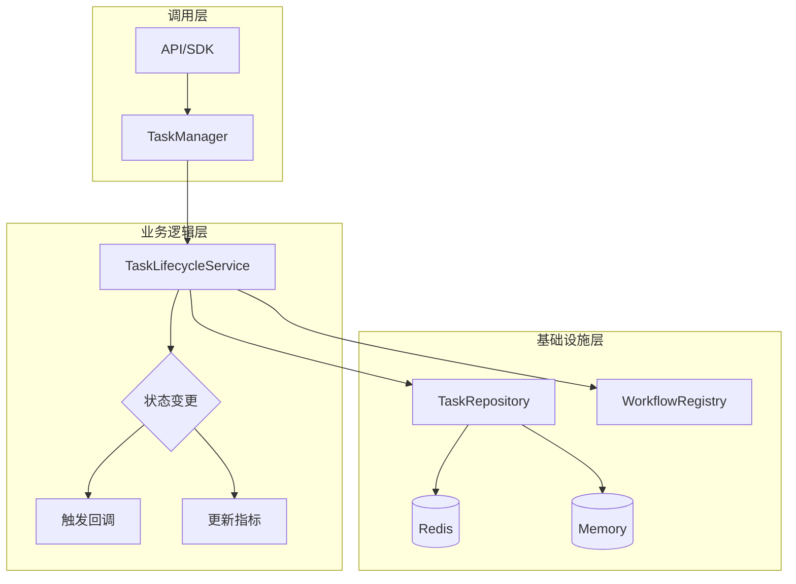
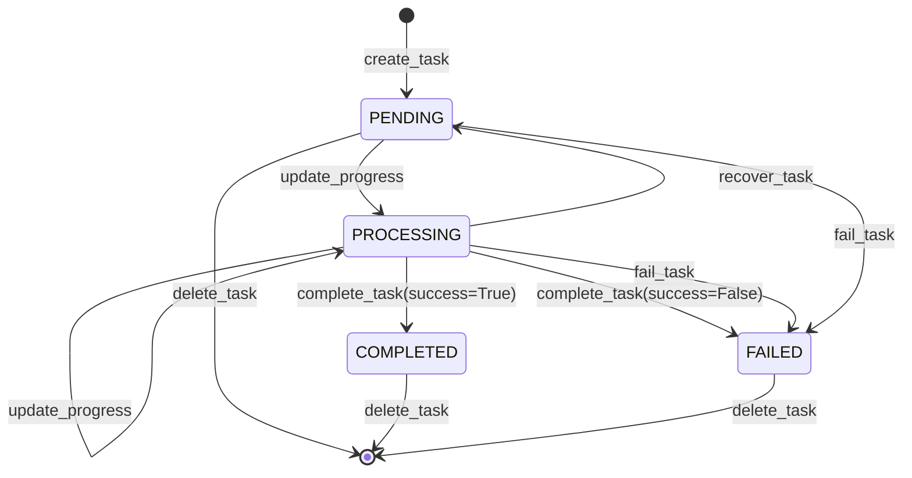

# 任务层拆分设计与实现文档

## 一、背景与目标

### 1.1 现状问题

当前 `TaskManager` 承担了过多职责：
- 任务存储管理（读写、持久化、TTL）
- 工作流缓存管理（创建、复用、销毁）
- 任务生命周期管理（状态推进、恢复、完成、失败）
- 指标统计（创建数、完成数、失败数）
- 回调管理

这种职责过载导致：
- 单元测试困难
- 职责边界模糊
- 难以替换底层存储实现
- 维护成本递增

### 1.2 目标

将任务层拆分为三个独立组件，实现职责单一：

| 组件 | 职责 | 状态 |
|------|------|------|
| **TaskRepository** | 任务读写、快照、TTL、双后端（内存/Redis） | 已存在，需完善 |
| **WorkflowRegistry** | Workflow/Pipeline 缓存与生命周期管理 | 已存在，需完善 |
| **TaskLifecycleService** | 状态推进、恢复、完成、失败、批量操作 | 需新增 |

---

## 二、架构设计

### 2.1 分层架构

```
┌─────────────────────────────────────────────────────────────┐
│                    TaskManager (协调层)                     │
│  对外统一入口，协调三个下层组件，保持向后兼容性               │
├─────────────────────────────────────────────────────────────┤
│                TaskLifecycleService                        │
│  业务逻辑层：状态机、生命周期管理、进度计算、回调触发         │
├─────────────────────────────────────────────────────────────┤
│              TaskRepository | WorkflowRegistry             │
│  基础设施层：任务持久化 | 工作流缓存                        │
└─────────────────────────────────────────────────────────────┘
```

### 2.2 组件关系



### 2.3 组件职责边界

| 组件 | 职责范围 | 不负责 |
|------|----------|--------|
| **TaskManager** | 对外统一接口、协调各组件、向后兼容 | 具体业务逻辑、存储实现 |
| **TaskLifecycleService** | 状态机管理、进度计算、回调触发、指标更新 | 底层存储、工作流缓存 |
| **TaskRepository** | 任务CRUD、快照导入导出、TTL管理、双后端 | 业务规则、状态转换 |
| **WorkflowRegistry** | 工作流缓存、LRU淘汰、生命周期管理 | 业务规则、任务存储 |

---

## 三、接口设计

### 3.1 TaskRepository 接口

```python
class TaskRepository:
    """负责任务记录的底层读写，不处理业务状态机。"""
    
    def create_task(task_id: str, record: Dict[str, Any], raw_config: Any = None) -> None:
        """创建任务记录"""
    
    def read_task(task_id: str) -> Optional[Dict[str, Any]]:
        """读取任务记录"""
    
    def write_task(task_id: str, record: Dict[str, Any]) -> bool:
        """写入任务记录"""
    
    def update_task(task_id: str, updater: Callable[[Dict[str, Any]], None]) -> bool:
        """更新任务记录（通过回调函数）"""
    
    def delete_task(task_id: str) -> bool:
        """删除任务记录"""
    
    def list_task_ids() -> list[str]:
        """获取所有任务ID"""
    
    def get_raw_config(task_id: str) -> Any:
        """获取原始配置"""
    
    def import_snapshot(snapshot: Dict[str, Any]) -> str:
        """导入任务快照"""
    
    def export_snapshot(task_id: str) -> Optional[Dict[str, Any]]:
        """导出任务快照"""
```

### 3.2 WorkflowRegistry 接口

```python
class WorkflowRegistry:
    """负责工作流实例缓存、复用和生命周期管理。"""
    
    def get(key: str) -> Optional[Any]:
        """获取缓存的工作流实例"""
    
    def put(key: str, workflow: Any) -> None:
        """缓存工作流实例"""
    
    def pop(key: str) -> Optional[Any]:
        """移除并返回工作流实例"""
    
    def clear() -> int:
        """清空所有缓存"""
    
    def keys() -> List[str]:
        """获取所有缓存键"""
    
    def shutdown(close_workflows: bool = True) -> int:
        """关闭所有工作流并清空缓存"""
```

### 3.3 TaskLifecycleService 接口

```python
class TaskLifecycleService:
    """负责任务状态机管理和生命周期控制。"""
    
    def create_task(script: str, script_id: Optional[str], 
                    style: Optional[VideoStyle], config: Optional[ShotConfig]) -> Tuple[str, str]:
        """创建任务，返回 script_id 和 task_id"""
    
    def update_progress(task_id: str, stage: TaskStage, 
                        progress: Optional[float], details: Optional[Dict[str, Any]]) -> bool:
        """更新任务进度"""
    
    def complete_stage(task_id: str, stage: TaskStage, result: Optional[Dict[str, Any]]) -> bool:
        """标记阶段完成"""
    
    def complete_task(task_id: str, result: Dict[str, Any]) -> None:
        """完成任务（成功或失败）"""
    
    def fail_task(task_id: str, error_message: str) -> None:
        """标记任务失败"""
    
    def recover_task(task_id: str) -> bool:
        """恢复任务（重置为 PENDING）"""
    
    def recover_all_pending_tasks(max_age_hours: int = 2) -> List[str]:
        """恢复所有未完成任务"""
    
    def get_pending_tasks(max_age_hours: int = 2) -> List[Dict[str, Any]]:
        """获取所有未完成任务"""
    
    def get_metrics() -> Dict[str, int]:
        """获取任务统计指标"""
    
    def set_callback(task_id: str, callback_url: str) -> bool:
        """设置任务回调URL"""
```

---

## 四、实现方案

### 4.1 TaskRepository（完善）

**文件位置**: `src/penshot/neopen/task/task_repository.py`

**新增方法**:
- `export_snapshot(task_id)` - 导出任务快照
- 完善 Redis 降级逻辑

### 4.2 WorkflowRegistry（完善）

**文件位置**: `src/penshot/neopen/task/workflow_registry.py`

**新增方法**:
- `contains(key)` - 检查键是否存在
- `size()` - 获取缓存大小

### 4.3 TaskLifecycleService（新增）

**文件位置**: `src/penshot/neopen/task/task_lifecycle_service.py`

**核心实现逻辑**:

```python
class TaskLifecycleService:
    def __init__(self, repository: TaskRepository, 
                 workflow_registry: WorkflowRegistry,
                 task_ttl_seconds: int = 86400):
        self.repository = repository
        self.workflow_registry = workflow_registry
        self.task_ttl_seconds = task_ttl_seconds
        self._metrics = {"created": 0, "completed": 0, "failed": 0}
        self._lock = RLock()
    
    def _generate_task_id(self, script_code: str) -> str:
        """生成唯一任务ID"""
        return "TSK" + script_code + str(random.randint(1000, 9999))
    
    def _calculate_overall_progress(self, progress_details: Dict) -> float:
        """计算整体进度百分比"""
        # 实现逻辑参考原 TaskManager._calculate_overall_progress
        pass
    
    def _trigger_callback(self, task_id: str, callback_url: str, result: Dict[str, Any]):
        """异步触发回调"""
        # 实现 HTTP 回调逻辑
        pass
    
    def create_task(self, script: str, script_id: Optional[str] = None,
                    style: Optional[VideoStyle] = None, 
                    config: Optional[ShotConfig] = None) -> Tuple[str, str]:
        # 1. 验证输入
        # 2. 生成ID
        # 3. 创建记录
        # 4. 持久化
        # 5. 更新指标
        pass
    
    def complete_task(self, task_id: str, result: Dict[str, Any]):
        # 1. 更新任务状态
        # 2. 更新指标
        # 3. 触发回调
        # 4. 清理工作流缓存（可选）
        pass
```

### 4.4 TaskManager（重构）

**文件位置**: `src/penshot/neopen/task/task_manager.py`

**重构策略**:
- 移除业务逻辑，转为协调层
- 调用 TaskLifecycleService 处理业务
- 保持原有 API 接口不变（向后兼容）

---

## 五、状态转换图



---

## 六、部署与集成

### 6.1 依赖关系

```
TaskManager
    ├── TaskLifecycleService
    │       ├── TaskRepository
    │       └── WorkflowRegistry
    └── WorkflowRegistry (直接访问用于缓存管理)
```

### 6.2 初始化顺序

```python
# 初始化顺序
repository = TaskRepository(task_ttl_seconds=86400)
workflow_registry = WorkflowRegistry(max_cache_size=64)
lifecycle_service = TaskLifecycleService(repository, workflow_registry)
task_manager = TaskManager(lifecycle_service, workflow_registry)
```

---

## 七、测试计划

### 7.1 单元测试

| 组件 | 测试重点 |
|------|----------|
| TaskRepository | CRUD操作、TTL管理、双后端切换、快照导入导出 |
| WorkflowRegistry | 缓存读写、LRU淘汰、生命周期管理 |
| TaskLifecycleService | 状态转换、进度计算、指标更新、回调触发 |
| TaskManager | 接口兼容性、协调逻辑 |

### 7.2 集成测试

- Redis 可用/不可用场景测试
- 任务恢复场景测试
- 并发任务场景测试
- 回调触发场景测试

---

## 八、代码安全性

### 8.1 注意事项

| 风险点 | 描述 | 缓解措施 |
|--------|------|----------|
| 任务ID伪造 | 恶意构造任务ID访问他人任务 | 使用加密ID生成方案 |
| Redis注入 | 通过任务数据注入Redis命令 | 严格数据验证和序列化 |
| 回调注入 | 恶意回调URL | URL白名单验证 |
| 资源耗尽 | 大量任务占用内存 | TTL自动清理、LRU淘汰 |
| 并发竞争 | 并发更新同一任务 | 使用Redis事务或乐观锁 |

### 8.2 安全实践

1. **输入验证**: 所有外部输入必须经过验证
2. **数据序列化**: 使用安全的JSON序列化
3. **Redis安全**: 使用Redis客户端的安全配置
4. **日志脱敏**: 日志中不记录敏感信息

---

## 九、实施计划

### 9.1 阶段一：新增 TaskLifecycleService

| 任务 | 描述 | 预估工时 |
|------|------|----------|
| T1 | 创建 TaskLifecycleService 类 | 8h |
| T2 | 实现核心业务逻辑 | 12h |
| T3 | 编写单元测试 | 6h |

### 9.2 阶段二：完善 Repository 和 Registry

| 任务 | 描述 | 预估工时 |
|------|------|----------|
| T4 | 完善 TaskRepository | 4h |
| T5 | 完善 WorkflowRegistry | 3h |
| T6 | 编写单元测试 | 4h |

### 9.3 阶段三：重构 TaskManager

| 任务 | 描述 | 预估工时 |
|------|------|----------|
| T7 | 重构 TaskManager 为协调层 | 8h |
| T8 | 确保向后兼容 | 4h |
| T9 | 集成测试 | 6h |

### 9.4 阶段四：验证与发布

| 任务 | 描述 | 预估工时 |
|------|------|----------|
| T10 | 全量测试 | 4h |
| T11 | 性能测试 | 4h |
| T12 | 文档更新 | 2h |

---

## 十、总结

通过将任务层拆分为三个独立组件：

1. **TaskRepository**: 专注于持久化，便于替换存储实现
2. **WorkflowRegistry**: 专注于工作流缓存，便于管理生命周期
3. **TaskLifecycleService**: 专注于业务逻辑，便于测试和迭代

**预期收益**:
- 降低耦合度，提高可测试性
- 清晰的职责边界，便于维护
- 灵活的存储替换能力
- 向后兼容，平滑迁移

---

**文档版本**: v1.0  
**生成日期**: 2026-04-29  
**适用项目**: PenShot (story-shot-agent)