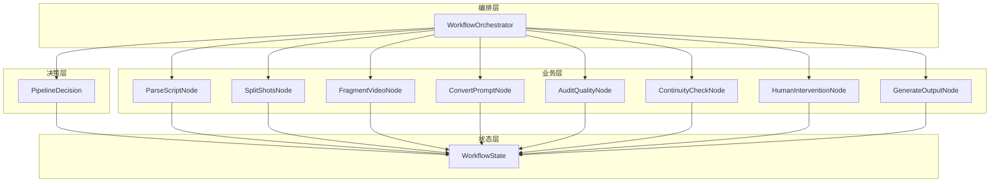
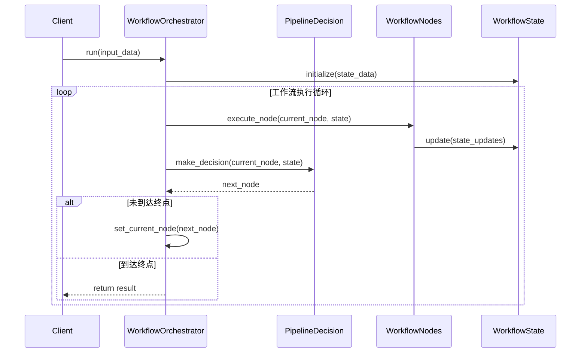
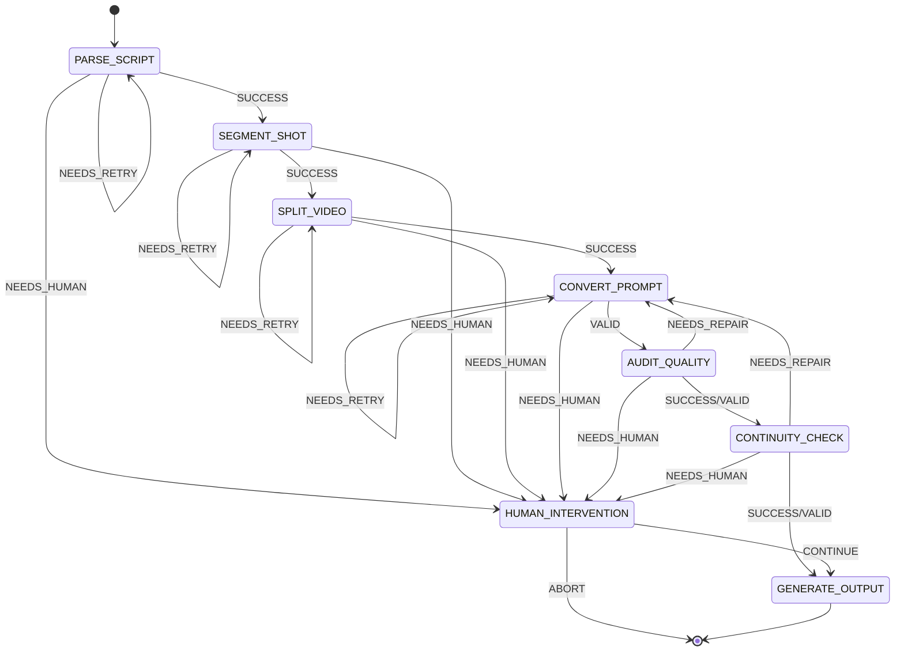

# 工作流职责拆分设计与实现文档

## 一、背景与目标

### 1.1 现状问题

当前 `workflow_nodes.py` 存在职责过载问题：
- 业务逻辑（剧本解析、镜头拆分等）
- 编排逻辑（节点间数据传递、状态更新）
- 决策逻辑（下一步该做什么）
- 状态管理（工作流状态的读写）

这种职责混合导致：
- 难以定位问题根因
- 测试复杂度高
- 维护成本递增
- 难以扩展新节点类型

### 1.2 目标

将工作流拆分为四个独立层级，实现职责单一：

| 层级 | 组件 | 职责 |
|------|------|------|
| **业务层** | WorkflowNodes | 纯业务逻辑执行 |
| **决策层** | PipelineDecision | 纯决策判断逻辑 |
| **编排层** | WorkflowOrchestrator | 路由控制、流程编排 |
| **状态层** | WorkflowState | 状态模型和状态管理 |

---

## 二、架构设计

### 2.1 分层架构

```
┌─────────────────────────────────────────────────────────────┐
│                    WorkflowOrchestrator                     │
│  编排层：路由控制、流程编排、节点调度                          │
├─────────────────────────────────────────────────────────────┤
│                      PipelineDecision                       │
│  决策层：纯决策判断、状态转换逻辑、循环控制                     │
├─────────────────────────────────────────────────────────────┤
│                       WorkflowNodes                         │
│  业务层：剧本解析、镜头拆分、视频分割、提示词转换等             │
├─────────────────────────────────────────────────────────────┤
│                        WorkflowState                        │
│  状态层：状态模型、数据结构、序列化                           │
└─────────────────────────────────────────────────────────────┘
```

### 2.2 组件关系



### 2.3 职责边界

| 组件 | 职责范围 | 不负责 |
|------|----------|--------|
| **WorkflowOrchestrator** | 定义流程结构、路由控制、节点调度 | 业务逻辑、决策判断 |
| **PipelineDecision** | 状态转换判断、循环控制、重试逻辑 | 业务执行、状态修改 |
| **WorkflowNodes** | 纯业务逻辑执行 | 流程控制、决策判断 |
| **WorkflowState** | 状态数据存储、序列化 | 业务逻辑、流程控制 |

---

## 三、接口设计

### 3.1 WorkflowOrchestrator 接口

```python
class WorkflowOrchestrator:
    """工作流编排器 - 负责流程结构定义和节点调度"""
    
    def build(self) -> CompiledGraph:
        """构建编译后的工作流图"""
    
    def add_node(self, name: str, node: Callable) -> None:
        """添加节点"""
    
    def add_edge(self, source: str, target: str) -> None:
        """添加边"""
    
    def add_conditional_edge(self, source: str, condition: Callable, mapping: Dict) -> None:
        """添加条件边"""
    
    def run(self, input_data: Dict) -> Dict:
        """运行工作流"""
    
    async def arun(self, input_data: Dict) -> Dict:
        """异步运行工作流"""
```

### 3.2 PipelineDecision 接口

```python
class PipelineDecision:
    """决策类 - 负责纯决策判断逻辑"""
    
    def decide_after_parsing(self, state: WorkflowState) -> PipelineState:
        """剧本解析后的决策"""
    
    def decide_after_splitting(self, state: WorkflowState) -> PipelineState:
        """镜头拆分后的决策"""
    
    def decide_after_fragmenting(self, state: WorkflowState) -> PipelineState:
        """视频分段后的决策"""
    
    def decide_after_prompts(self, state: WorkflowState) -> PipelineState:
        """提示词生成后的决策"""
    
    def decide_after_audit(self, state: WorkflowState) -> PipelineState:
        """质量审查后的决策"""
    
    def decide_after_continuity(self, state: WorkflowState) -> PipelineState:
        """连续性检查后的决策"""
    
    def decide_after_error(self, state: WorkflowState) -> PipelineState:
        """错误处理后的决策"""
    
    def decide_after_human(self, state: WorkflowState) -> PipelineState:
        """人工干预后的决策"""
```

### 3.3 WorkflowNodes 接口

```python
class WorkflowNodes:
    """工作流节点集合 - 负责纯业务逻辑执行"""
    
    def parse_script_node(self, state: WorkflowState) -> WorkflowState:
        """剧本解析节点"""
    
    def split_shots_node(self, state: WorkflowState) -> WorkflowState:
        """镜头拆分节点"""
    
    def fragment_video_node(self, state: WorkflowState) -> WorkflowState:
        """视频分段节点"""
    
    def convert_prompt_node(self, state: WorkflowState) -> WorkflowState:
        """提示词转换节点"""
    
    def audit_quality_node(self, state: WorkflowState) -> WorkflowState:
        """质量审查节点"""
    
    def continuity_check_node(self, state: WorkflowState) -> WorkflowState:
        """连续性检查节点"""
    
    def human_intervention_node(self, state: WorkflowState) -> WorkflowState:
        """人工干预节点"""
    
    def generate_output_node(self, state: WorkflowState) -> WorkflowState:
        """生成输出节点"""
```

### 3.4 WorkflowState 接口

```python
class WorkflowState(TypedDict):
    """工作流状态 - 定义状态数据结构"""
    
    script_id: str
    task_id: str
    raw_script: str
    parsed_script: Optional[ParsedScript]
    shot_sequence: Optional[ShotSequence]
    fragment_sequence: Optional[FragmentSequence]
    instructions: Optional[AIInstructions]
    audit_report: Optional[QualityAuditReport]
    continuity_issues: List[ContinuityIssue]
    
    current_stage: AgentStage
    current_node: PipelineNode
    last_node: Optional[PipelineNode]
    
    status: TaskStatus
    error: Optional[str]
    error_messages: List[str]
    
    stage_current_retries: Dict[PipelineNode, int]
    stage_max_retries: Dict[PipelineNode, int]
    total_retries: int
    
    node_current_loops: Dict[PipelineNode, int]
    node_max_loops: Dict[PipelineNode, int]
    node_loop_exceeded: Dict[PipelineNode, bool]
    
    global_current_loops: int
    global_max_loops: int
    global_loop_exceeded: bool
    
    recovery_flags: Dict[str, Any]
    human_feedback: Dict[str, Any]
```

---

## 四、实现方案

### 4.1 WorkflowOrchestrator（新增）

**文件位置**: `src/penshot/neopen/agent/workflow/workflow_orchestrator.py`

**核心职责**:
- 定义流程结构
- 管理节点注册
- 控制路由逻辑
- 调度节点执行

### 4.2 PipelineDecision（完善）

**文件位置**: `src/penshot/neopen/agent/workflow/workflow_decision.py`

**改进内容**:
- 保持纯决策逻辑，不修改状态
- 增加策略模式支持
- 提取通用决策方法

### 4.3 WorkflowNodes（重构）

**文件位置**: `src/penshot/neopen/agent/workflow/workflow_nodes.py`

**重构策略**:
- 移除决策逻辑
- 移除编排逻辑
- 专注于业务执行
- 保持状态读写

### 4.4 WorkflowState（完善）

**文件位置**: `src/penshot/neopen/agent/workflow/workflow_states.py`

**改进内容**:
- 清晰的数据结构定义
- 状态校验方法
- 序列化/反序列化方法

---

## 五、流程执行示例



---

## 六、状态转换图



---

## 七、测试计划

### 7.1 单元测试

| 组件 | 测试重点 |
|------|----------|
| WorkflowOrchestrator | 流程结构构建、路由控制、节点调度 |
| PipelineDecision | 决策逻辑正确性、边界条件、状态转换 |
| WorkflowNodes | 业务逻辑正确性、状态更新、错误处理 |
| WorkflowState | 数据结构完整性、序列化/反序列化 |

### 7.2 集成测试

- 完整流程测试（正常路径）
- 错误恢复测试（异常路径）
- 循环控制测试（边界情况）
- 人工干预测试（交互场景）

---

## 八、代码安全性

### 8.1 注意事项

| 风险点 | 描述 | 缓解措施 |
|--------|------|----------|
| 状态篡改 | 恶意修改状态数据 | 状态校验、不可变数据结构 |
| 循环攻击 | 恶意构造无限循环 | 全局循环限制、节点循环限制 |
| 资源耗尽 | 大剧本导致内存溢出 | 分块处理、内存监控 |
| 注入攻击 | 通过输入注入恶意代码 | 输入验证、参数化查询 |

### 8.2 安全实践

1. **状态校验**: 每个节点执行前校验状态完整性
2. **输入验证**: 严格验证所有外部输入
3. **循环保护**: 双重循环限制（节点级、全局级）
4. **日志脱敏**: 日志中不记录敏感信息

---

## 九、实施计划

### 9.1 阶段一：创建 Orchestrator

| 任务 | 描述 | 预估工时 |
|------|------|----------|
| T1 | 创建 WorkflowOrchestrator 类 | 6h |
| T2 | 实现流程构建和路由控制 | 8h |
| T3 | 编写单元测试 | 4h |

### 9.2 阶段二：重构 Nodes

| 任务 | 描述 | 预估工时 |
|------|------|----------|
| T4 | 移除决策逻辑到 Decision | 8h |
| T5 | 移除编排逻辑到 Orchestrator | 6h |
| T6 | 编写单元测试 | 6h |

### 9.3 阶段三：完善 State

| 任务 | 描述 | 预估工时 |
|------|------|----------|
| T7 | 定义清晰的数据结构 | 4h |
| T8 | 添加状态校验方法 | 4h |
| T9 | 添加序列化方法 | 4h |

### 9.4 阶段四：集成测试

| 任务 | 描述 | 预估工时 |
|------|------|----------|
| T10 | 完整流程测试 | 6h |
| T11 | 错误恢复测试 | 4h |
| T12 | 性能测试 | 4h |

---

## 十、总结

通过将工作流拆分为四个独立层级：

1. **WorkflowOrchestrator**: 专注于流程编排和路由控制
2. **PipelineDecision**: 专注于决策判断逻辑
3. **WorkflowNodes**: 专注于业务执行
4. **WorkflowState**: 专注于状态管理

**预期收益**:
- 职责清晰，便于定位问题
- 高可测试性，各层可独立测试
- 易于扩展，可方便添加新节点
- 降低维护成本，代码更易于理解

---

**文档版本**: v1.0  
**生成日期**: 2026-04-29  
**适用项目**: PenShot (story-shot-agent)