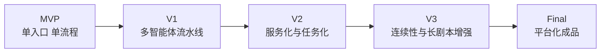
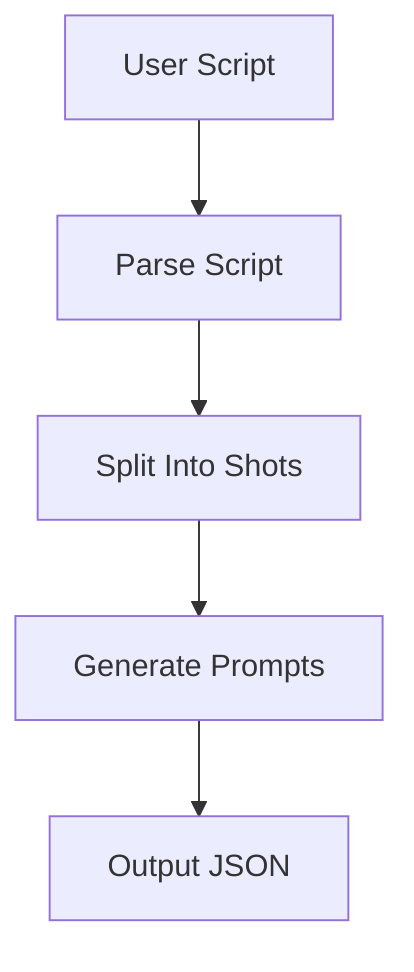
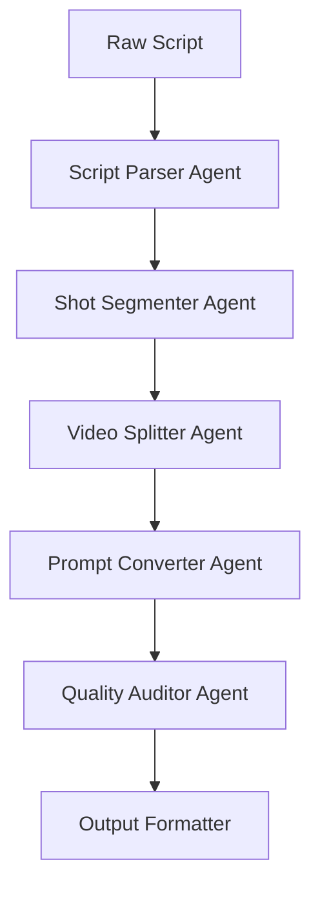
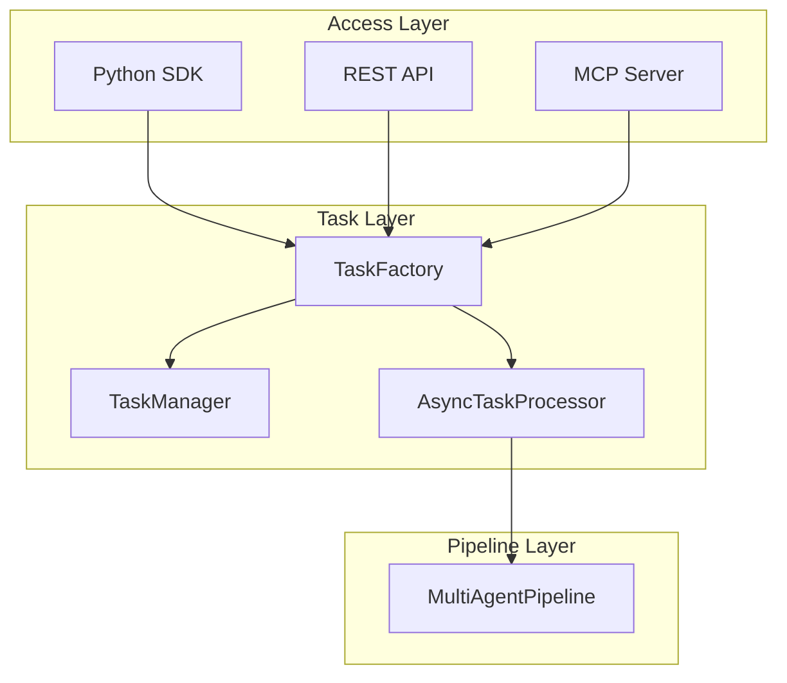
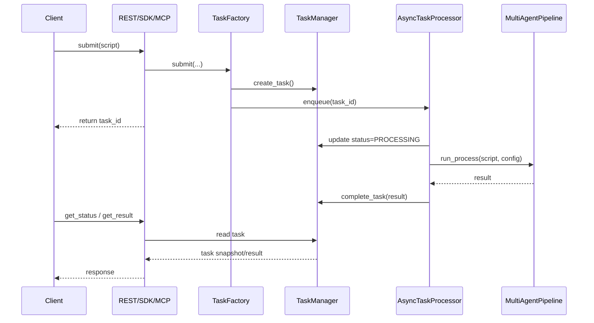
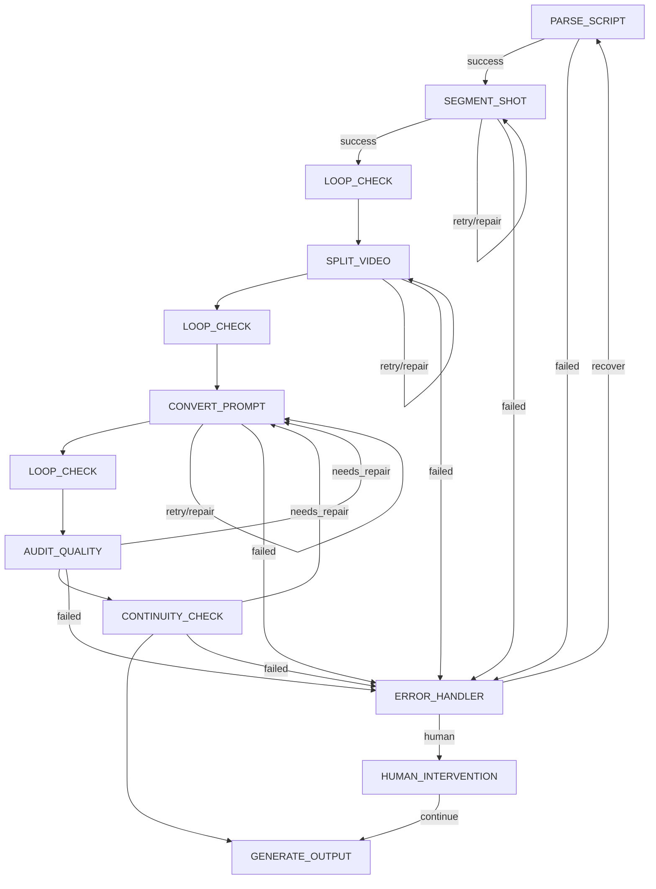
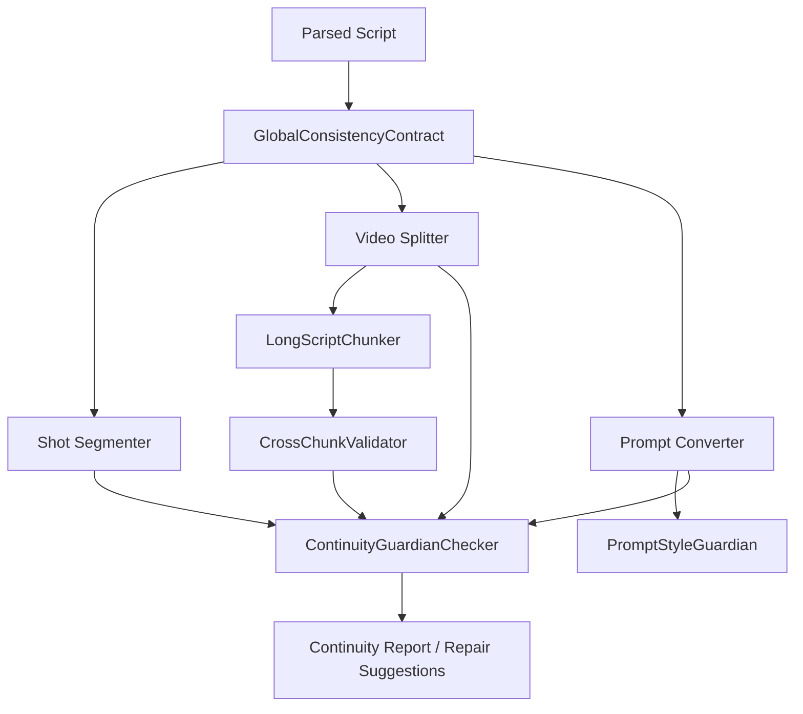
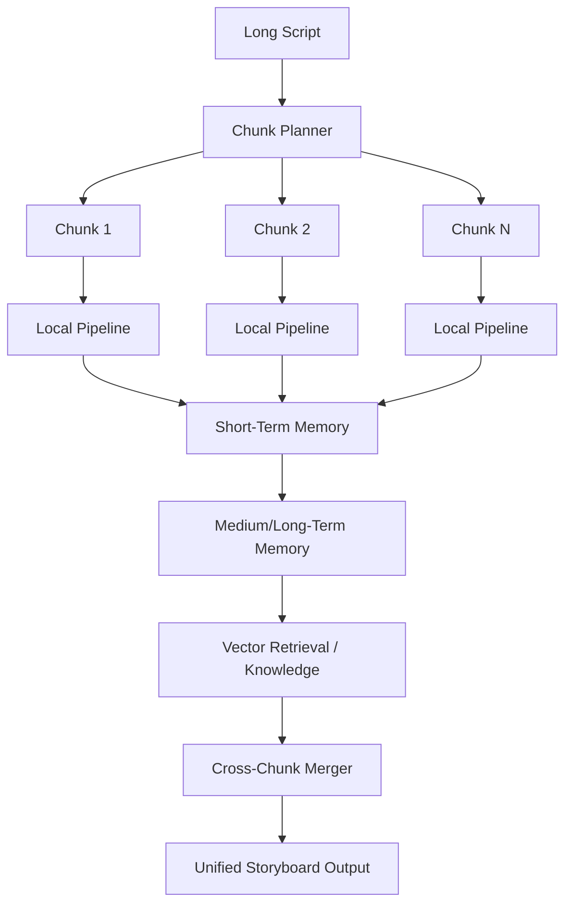
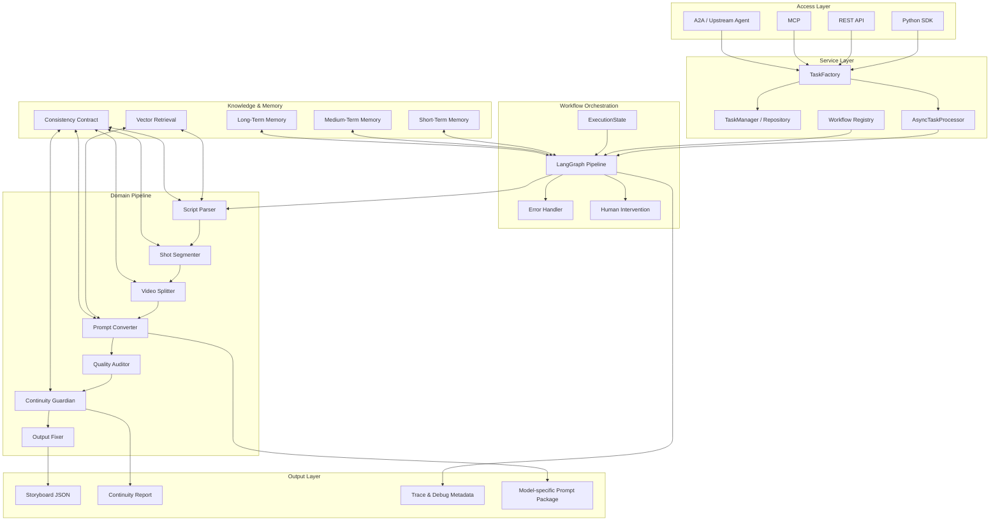
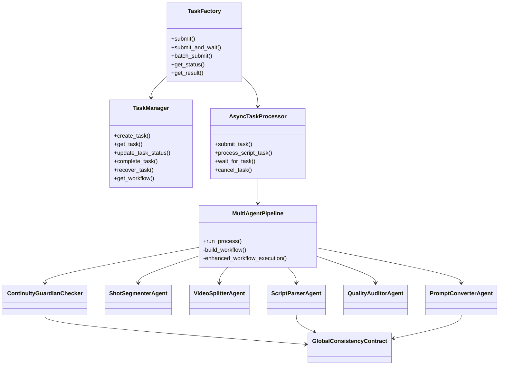

# PenShot 架构演进：从 MVP 到成品

## 1. 文档目标

本文以 `PenShot` 当前项目为基础，梳理它从最初 MVP 到最终成品形态的一条可落地架构演进路线。

这不是脱离代码现实的概念稿，而是基于当前仓库已经具备的核心能力来展开：

- 多智能体分阶段流水线
- `TaskManager` / `AsyncTaskProcessor` 任务执行体系
- `LangGraph` 工作流编排
- `script_parser -> shot_segmenter -> video_splitter -> prompt_converter -> quality_auditor -> continuity_guardian` 主链路
- SDK / REST API / MCP 多入口接入
- 持续增强中的连续性契约、长剧本分块、跨块校验与风格守护

如果用一句话概括 `PenShot` 的演进目标，那就是：

> 从一个“把剧本切成短视频片段提示词”的工具，演进为一个“面向长剧本、多模型、多片段连续性约束的分镜生产平台”。

---

## 2. 项目愿景

AI 视频模型天然存在单次生成时长有限、角色稳定性差、跨片段连续性弱的问题。  
因此，`PenShot` 的使命不是简单生成一条 prompt，而是承担“上游剧本理解”和“下游视频生成之间的中间生产层”。

它最终要解决的是三个核心问题：

1. 把原始剧本稳定解析为结构化叙事单元。
2. 把长叙事拆解成适合视频模型消费的镜头与片段。
3. 在跨片段、跨场景、跨模型的情况下，尽量保持角色、动作、场景与风格的一致性。

---

## 3. 演进总览

每个阶段都不是推翻重来，而是在前一阶段基础上增加一层能力。

---

## 4. Phase 0: MVP

### 4.1 MVP 目标

MVP 阶段不追求“最强质量”，而追求最短路径验证价值：

- 给定一段剧本
- 调用 LLM 解析内容
- 输出若干个短视频片段描述

这个阶段的关键不是完整性，而是验证两件事：

1. 剧本确实可以被拆解成适合 AI 视频模型消费的片段。
2. 用户真的需要“从故事到分镜”的中间层。

### 4.2 MVP 架构特征

- 单入口，通常是本地 Python 调用
- 单次同步执行
- 一个主流程函数串联多个步骤
- 状态以内存对象为主
- 失败后直接报错，几乎没有恢复机制

### 4.3 MVP 架构图

### 4.4 MVP 阶段的局限

- 无法服务化接入
- 长文本处理能力弱
- 没有任务队列
- 没有多阶段质量控制
- 连续性完全依赖一次性 prompt 运气

### 4.5 MVP 阶段的价值

虽然简单，但它定义了 `PenShot` 的基本产品闭环：  
`Script -> Structured Breakdown -> Prompt Fragments`

这也是后续所有复杂架构的原点。

---

## 5. Phase 1: 多智能体流水线化

### 5.1 为什么进入这个阶段

当 MVP 被验证后，最大问题会立刻出现：

- 剧本解析和提示词生成混在一起，难以调优
- 不同类型问题无法分阶段定位
- 某一步失败时无法只修那一步

所以第一轮关键演进不是“接更多模型”，而是把单流程拆成多阶段流水线。

### 5.2 核心设计思想

把一个大问题拆成多个相对稳定的子问题：

- 剧本理解
- 镜头拆分
- 片段时长控制
- 提示词转换
- 结果审查

这正是当前项目已经形成的主要骨架。

### 5.3 多智能体阶段架构图

### 5.4 这个阶段的收益

- 每个环节都有独立职责
- 更容易替换为 `rule` 或 `llm` 双实现
- 便于插入审查、修复和重试
- 输出结构逐渐规范化

### 5.5 对应到当前项目

当前仓库中的以下模块，就是这一阶段架构的直接体现：

- `src/penshot/neopen/agent/script_parser_agent.py`
- `src/penshot/neopen/agent/shot_segmenter_agent.py`
- `src/penshot/neopen/agent/video_splitter_agent.py`
- `src/penshot/neopen/agent/prompt_converter_agent.py`
- `src/penshot/neopen/agent/quality_auditor_agent.py`

这说明 `PenShot` 已经从“工具函数”迈入“可编排流水线”。

---

## 6. Phase 2: 服务化与任务化

### 6.1 为什么必须任务化

一旦系统开始面对：

- 长文本
- 外部接口调用
- 多个并发请求
- 异步等待结果

单次同步函数就不够了。

此时需要引入三个能力：

1. 任务创建与状态跟踪
2. 后台执行与并发控制
3. 多协议接入

### 6.2 该阶段的关键模块

这一阶段在当前项目里已经非常清晰：

- `TaskManager`: 管理任务状态、缓存、恢复、结果
- `AsyncTaskProcessor`: 后台线程 + 事件循环 + 队列调度
- `TaskFactory`: 对外屏蔽复杂任务生命周期
- `rest_api.py`: HTTP 接入
- `function_calls.py`: Python SDK 接入
- `mcp_server.py`: MCP 接入

### 6.3 服务化阶段架构图

### 6.4 任务生命周期时序图

### 6.5 这个阶段带来的本质变化

到了这里，`PenShot` 就不再是一个只能本地调用的脚本库，而是一个具备服务化雏形的 AI 引擎。

这也是项目真正具有平台潜力的起点。

---

## 7. Phase 3: 工作流编排与可恢复控制

### 7.1 为什么要引入工作流引擎

当智能体节点越来越多后，问题不再是“有没有这些模块”，而变成：

- 失败了怎么回退？
- 某个阶段需不需要人工介入？
- 某个节点重试多少次？
- 流程如何在不同节点之间跳转？

这就需要把“执行顺序”从代码硬编码升级为“显式工作流”。

### 7.2 当前项目中的体现

`MultiAgentPipeline` 与 `workflow_pipeline.py` 已经承担了这个角色：

- 显式声明节点
- 条件路由
- 循环检查
- 错误处理
- 人工干预
- 输出修复

### 7.3 工作流阶段架构图

### 7.4 这一阶段的意义

它让系统从“线性调用链”升级为“可恢复状态机”。

在 AI 系统里，这是非常关键的一步，因为很多错误不是 bug，而是模型不稳定、输出不合规、上下文失真。这些问题无法只靠 try/except 解决，必须靠工作流语义来吸收。

---

## 8. Phase 4: 连续性系统成为核心能力

### 8.1 为什么连续性是架构分水岭

对于短视频片段，prompt 写得不错就能看。  
但对长叙事视频来说，真正的难点在于：

- 同一角色在第 1 段和第 8 段是否还是“同一个人”
- 场景切换是否合理
- 时间线是否连续
- 风格是否漂移
- 超长剧本分块后是否还能保持整体叙事稳定

因此，连续性不是“锦上添花”，而是长视频生产系统的核心支柱。

### 8.2 当前项目已出现的关键原型

这一方向在仓库中已经有清晰迹象：

- `consistency_contract.py`
- `continuity_guardian_checker.py`
- `cross_chunk_validator.py`
- `long_script_chunker.py`
- `prompt_style_guardian.py`

这些模块说明项目已经开始从“生成内容”转向“约束生成”。

### 8.3 连续性增强阶段架构图

### 8.4 这一阶段的关键变化

过去：

- 连续性主要靠 prompt 补充描述
- 问题往往在最终结果出来后才暴露

未来：

- 连续性成为贯穿解析、拆分、切段、提示词生成的前置约束
- 每个阶段都可以消费与更新一致性契约

### 8.5 建议中的核心抽象

未来可以把连续性体系进一步抽象为三层：

1. `Planner`  
   提前定义角色、场景、风格、时间约束

2. `Validator`  
   检查每阶段产物是否违反约束

3. `Repairer`  
   自动生成修复建议或直接修正输出

这会让 `continuity_guardian` 从“检查器”真正升级为“连续性子系统”。

---

## 9. Phase 5: 长剧本、记忆与知识增强

### 9.1 长剧本为什么必须单独建模

单段脚本和长剧本在架构上不是同一个问题。

长剧本会引入：

- 上下文窗口不足
- 远距离角色召回
- 场景跨块跳转
- 风格漂移累积
- 中间结果过多，难以追踪

因此，长剧本能力不应只是“文本更长”，而应有独立的处理模式。

### 9.2 当前项目的基础

当前项目已经具备相关支撑层：

- `knowledge/memory/short_term_memory.py`
- `knowledge/memory/medium_term_memory.py`
- `knowledge/memory/long_term_memory.py`
- `knowledge/llamaIndex/...`
- `long_script_chunker.py`

这意味着架构上已经留好了继续向长剧本演进的地基。

### 9.3 长剧本增强架构图

### 9.4 这一阶段的产品价值

这一步完成后，`PenShot` 就不只是“支持长文本”，而是具备了“超长剧本分块生产能力”。

这会成为项目非常强的差异化能力。

---

## 10. Phase 6: 最终成品形态

### 10.1 成品应具备的能力

最终版本的 `PenShot`，应当是一个完整的“剧本到分镜生产平台”，具备以下特征：

- 多入口接入：SDK、REST、MCP、A2A
- 多阶段工作流：解析、规划、切段、转换、审查、连续性修复
- 显式任务管理：排队、重试、恢复、回调、统计
- 长剧本支持：分块、记忆、跨块合并
- 多模型适配：面向不同视频模型输出差异化结果
- 可解释性输出：每阶段摘要、连续性报告、来源追踪

### 10.2 最终成品逻辑架构图

### 10.3 最终成品的 UML 组件图

---

## 11. 每个阶段要解决的核心问题

| 阶段 | 架构关键词 | 主要解决的问题 | 对产品的意义 |
|---|---|---|---|
| MVP | 单流程 | 先验证“剧本可否转分镜” | 验证需求成立 |
| V1 | 多智能体流水线 | 拆分复杂度，便于调优 | 提升质量与可维护性 |
| V2 | 任务化、服务化 | 异步处理、多入口接入 | 可集成、可部署 |
| V3 | 工作流编排 | 重试、回退、人工介入 | 提升稳定性 |
| V4 | 连续性系统 | 角色/场景/风格一致性 | 解决长视频核心痛点 |
| V5 | 长剧本与记忆 | 超长文本处理与跨块稳定 | 形成差异化能力 |
| Final | 平台化成品 | 统一输出、模型适配、可解释性 | 面向真实生产环境 |

---

## 12. 推荐实施步骤

为了让演进路线更贴近当前项目，我建议优先级按下面推进。

### Step 1: 固化当前主链路

- 继续稳定现有 `MultiAgentPipeline`
- 为主流程补足系统级测试
- 把任务层和工作流层职责继续拉开

### Step 2: 明确状态模型

- 区分 `ExecutionState` 与 `DomainState`
- 减少工作流控制字段和业务字段混杂
- 让每个 agent 只处理明确输入与输出

### Step 3: 正式接入连续性契约

- 让 `GlobalConsistencyContract` 贯穿解析、拆镜、切片、转 prompt
- 不再只在末端检查连续性
- 让连续性变成“前置约束 + 末端验证”

### Step 4: 把长剧本模式独立出来

- 自动识别超长输入
- 引入 chunk planner
- 接入 cross-chunk validator
- 汇总统一输出与全局风格修正

### Step 5: 做面向成品的输出层

- 模型适配输出
- 调试元数据输出
- 连续性报告输出
- 更强的可观测性与管理接口

---

## 13. 对外叙事建议

如果这篇文档将用于博客和官网，建议对外采用这样的叙事主线：

### 对外核心表述

`PenShot` 不是一个简单的 Prompt Generator，  
而是一个面向长剧本与短视频生成约束的中间层生产系统。

### 对外重点强调的三点

1. **分阶段生成**  
   不是把所有事情交给一次模型调用，而是拆成解析、规划、切片、转换、审查、连续性控制等多个步骤。

2. **任务化服务能力**  
   支持 SDK、REST、MCP 等多入口接入，适合成为上游写作智能体与下游视频生成系统之间的桥梁。

3. **连续性与长剧本能力**  
   真正解决“多个短视频片段如何拼成一个完整叙事”的关键问题。

---

## 14. 总结

从架构演进角度看，`PenShot` 的成长路径非常清晰：

- 先用 MVP 验证“剧本到分镜”的价值；
- 再通过多智能体流水线把复杂问题拆开；
- 再通过任务系统与工作流让系统可服务、可恢复、可集成；
- 最后通过连续性契约、长剧本分块、记忆与模型适配，走向真正的平台化成品。

这条路线既没有脱离当前项目，也保留了未来扩展空间。

如果说 MVP 解决的是“能不能做”，  
那么最终成品要解决的就是“能不能稳定地做、长期地做、在复杂约束下依然做得好”。

