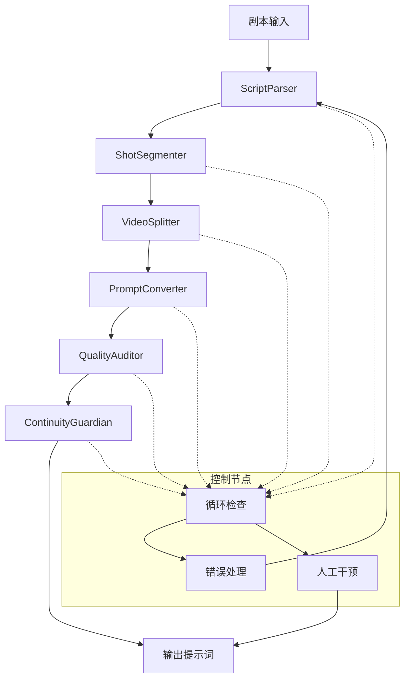

# PenShot 项目全面分析与优化报告

## 一、项目概述

PenShot（PyPI名称：penshot）是一个**多智能体协作的剧本分镜生成系统**，核心目标是将自然语言剧本自动拆分为适合 AI 视频模型（如 Sora、Runway、Pika、可灵等）的短片段提示词，并确保叙事连续性。

### 核心价值定位

| 维度 | 描述 |
|------|------|
| **输入** | 自然语言剧本、结构化场景描述、对话文本 |
| **处理** | 多阶段智能体流水线处理 |
| **输出** | 面向 AI 视频模型的结构化分镜提示词 |
| **核心竞争力** | 长剧本处理、连续性保证、多模型适配 |

### 技术栈

| 分类 | 技术 | 版本要求 |
|------|------|----------|
| 框架 | LangChain / LangGraph | >=1.0 |
| 向量存储 | Chroma | >=1.5.6 |
| Web 框架 | FastAPI / Uvicorn | >=0.104 |
| 数据库 | Redis（可选） | >=5.0 |
| 语言 | Python | >=3.10 |

---

## 二、项目架构分析

### 2.1 分层架构

```
┌─────────────────────────────────────────────────────────────────┐
│                      接入层 (Access Layer)                      │
│  REST API | MCP | A2A | Python SDK | LangGraph Node            │
├─────────────────────────────────────────────────────────────────┤
│                    任务与执行层 (Task Layer)                     │
│  TaskManager | TaskProcessor | WorkflowRegistry | 队列管理       │
├─────────────────────────────────────────────────────────────────┤
│                   核心工作流层 (Workflow Layer)                 │
│  MultiAgentPipeline | LangGraph | 状态管理 | 决策路由           │
├─────────────────────────────────────────────────────────────────┤
│                   领域智能体层 (Agent Layer)                     │
│  ScriptParser | ShotSegmenter | VideoSplitter | PromptConverter │
│  QualityAuditor | ContinuityGuardian                           │
├─────────────────────────────────────────────────────────────────┤
│                支撑层 (Support Layer)                           │
│  LLM Client | Embedding | VectorDB | Config | Prompts | Tools  │
└─────────────────────────────────────────────────────────────────┘
```

### 2.2 核心工作流



### 2.3 关键组件职责

| 组件 | 职责 | 状态 |
|------|------|------|
| **TaskManager** | 任务创建、状态管理、持久化、恢复 | 完善 |
| **MultiAgentPipeline** | LangGraph 工作流编排 | 完善 |
| **ScriptParser** | 剧本解析为结构化场景 | 完善 |
| **ShotSegmenter** | 场景拆分为镜头 | 完善 |
| **VideoSplitter** | 镜头切割为片段 | 完善 |
| **PromptConverter** | 片段转为提示词 | 完善 |
| **QualityAuditor** | 质量审查 | 完善 |
| **ContinuityGuardian** | 连续性检查与修复 | 发展中 |

### 2.4 目录结构

```
src/penshot/
├── api/                    # 对外 API 接口
│   ├── index_api.py        # 基础接口
│   ├── rest_api.py         # REST API
│   └── function_calls.py   # 函数调用接口
├── app/                    # 应用配置
│   ├── application.py      # 应用入口
│   └── setup_env.py        # 环境配置
├── config/                 # 配置文件管理
│   ├── config.py           # 配置加载
│   └── env/                # 环境配置文件
├── neopen/                 # 核心业务模块
│   ├── agent/              # 智能体模块
│   │   ├── script_parser/      # 剧本解析
│   │   ├── shot_segmenter/     # 镜头拆分
│   │   ├── video_splitter/     # 视频分割
│   │   ├── prompt_converter/   # 提示词转换
│   │   ├── quality_auditor/    # 质量审计
│   │   ├── continuity_guardian/# 连续性守护
│   │   ├── workflow/           # 工作流编排
│   │   └── human_decision/     # 人工决策干预
│   ├── client/             # LLM 客户端
│   ├── config/             # 业务配置
│   ├── knowledge/          # 知识库
│   ├── prompts/            # 提示词模板
│   └── task/               # 任务管理
├── utils/                  # 工具函数
├── http_server.py          # HTTP 服务器
├── mcp_server.py           # MCP 服务器
└── logger.py               # 日志配置
```

---

## 三、优势分析

### 3.1 架构设计优势

1. **分层解耦**：清晰的职责边界，便于独立迭代各模块
2. **多协议支持**：REST API、MCP、A2A、SDK 多种接入方式
3. **工作流引擎**：基于 LangGraph 的状态机设计，支持复杂路由和错误处理
4. **任务管理成熟**：支持 Redis 持久化、任务恢复、进度追踪
5. **可扩展性**：插件化设计，易于添加新的 LLM provider 和视频模型适配

### 3.2 功能完整性

| 功能 | 状态 | 说明 |
|------|------|------|
| 剧本解析 | ✅ | 支持多种格式剧本 |
| 镜头拆分 | ✅ | 智能时长估算 |
| 片段切割 | ✅ | 符合 AI 视频模型限制 |
| 提示词生成 | ✅ | 多语言支持 |
| 质量审计 | ✅ | 规则 + LLM 双重审查 |
| 连续性检查 | ⚡ | 正在强化中 |
| 长剧本处理 | ⚡ | 分块机制已实现 |

### 3.3 工程化能力

- **配置管理**：完整的配置体系，支持环境隔离
- **日志系统**：完善的日志记录和调试支持
- **指标监控**：任务统计、性能监控
- **错误恢复**：自动重试、任务恢复机制
- **Redis 集成**：支持任务持久化和分布式部署

---

## 四、现存问题

### 4.1 架构层面问题

#### 问题1：工作流层职责过重

**现象**：`workflow_nodes.py` 成为业务逻辑黑洞，混合了编排、决策、业务逻辑

**影响**：
- 难以定位问题根因
- 测试复杂度高
- 维护成本递增

**代码位置**：`src/penshot/neopen/agent/workflow/workflow_nodes.py`

#### 问题2：状态管理混乱

**现象**：工作流状态同时包含执行状态和领域状态

**影响**：
- 状态臃肿
- 序列化困难
- 难以做状态迁移测试

**代码位置**：`src/penshot/neopen/agent/workflow/workflow_states.py`

#### 问题3：任务层职责过载

**现象**：`TaskManager` 承担了存储、缓存、工作流管理、指标等多种职责

**影响**：
- 单元测试困难
- 职责边界模糊
- 难以替换底层存储

**代码位置**：`src/penshot/neopen/task/task_manager.py`

### 4.2 功能层面问题

#### 问题4：连续性检查后置

**现象**：连续性检查主要在末尾阶段进行

**影响**：
- 早期阶段无法利用连续性约束
- 修复成本高
- 可能产生连锁错误

**代码位置**：`src/penshot/neopen/agent/continuity_guardian/`

#### 问题5：长剧本模式未集成主流程

**现象**：`long_script_chunker.py` 已存在但未成为标准路径

**影响**：
- 长剧本处理不稳定
- 用户体验不一致
- 跨块一致性难以保证

**代码位置**：`src/penshot/neopen/agent/continuity_guardian/long_script_chunker.py`

#### 问题6：模型适配仅停留在 Provider 层

**现象**：只适配了 LLM provider，未针对目标视频模型优化

**影响**：
- 输出提示词通用性强但针对性弱
- 无法充分利用各视频模型特性
- 生成质量受限

**代码位置**：`src/penshot/neopen/agent/prompt_converter/`

### 4.3 测试与质量问题

#### 问题7：测试覆盖率不足

**现象**：缺少工作流级测试、错误恢复测试、跨模块集成测试

**影响**：
- 回归风险高
- 难以重构
- 发布信心不足

**测试目录**：`tests/`

#### 问题8：缺少统一评估指标

**现象**：质量审计依赖主观判断，缺少量化指标

**影响**：
- 难以衡量改进效果
- 用户无法了解输出质量
- 难以做 A/B 测试

---

## 五、优化建议

### 5.1 架构优化

#### 优化1：拆分工作流职责

**方案**：
- 将编排逻辑与业务决策分离
- 定义清晰的节点接口契约
- 引入策略模式处理决策逻辑

**实施计划**：
1. 提取决策逻辑到独立模块
2. 定义节点输入输出契约
3. 重构工作流节点为纯编排层

**预期收益**：
- 降低耦合度
- 提高可测试性
- 便于独立迭代

#### 优化2：分离状态模型

**方案**：
- `ExecutionState`: 节点、重试、超时、回退原因、人工干预
- `DomainState`: 解析结果、镜头、片段、提示词、契约、审计信息

**实施计划**：
1. 创建独立的状态类
2. 更新工作流使用新状态结构
3. 提供状态转换工具函数

**预期收益**：
- 状态更清晰
- 便于序列化和恢复
- 支持状态迁移测试

#### 优化3：拆分任务层

**方案**：
- `TaskRepository`: 存储、快照、TTL、双后端（内存/Redis）
- `WorkflowRegistry`: workflow/pipeline 缓存与生命周期管理
- `TaskLifecycleService`: 状态推进、恢复、完成、失败、回调

**实施计划**：
1. 提取 `TaskRepository` 接口和实现
2. 分离 `WorkflowRegistry`
3. 重构 `TaskManager` 为协调层

**预期收益**：
- 职责单一
- 易于测试
- 便于替换底层实现

### 5.2 功能优化

#### 优化4：连续性前置化

**方案**：
- 解析阶段提取角色/场景/风格锚点
- 镜头拆分阶段使用锚点做约束
- 片段切割阶段继承时间与动作连续性
- prompt 生成阶段注入稳定的角色与风格约束
- 最后用 Guardian 做审计和修复

**实施计划**：
1. 定义 `ConsistencyAnchor` 数据结构
2. 在解析阶段生成锚点
3. 修改各阶段使用锚点约束
4. 优化 Guardian 作为最终校验

**预期收益**：
- 早期发现连续性问题
- 降低修复成本
- 提高输出一致性

#### 优化5：长剧本模式升级

**方案**：
- 定义明确的模式级别（短文本/中长文本/超长剧本）
- 超长模式默认启用：分块规划、重叠场景、全局契约合并、块间过渡校验
- 提供分块结果汇总与风格统一修正

**实施计划**：
1. 定义模式级别配置
2. 将长剧本分块器接入主流程
3. 实现跨块一致性校验
4. 添加结果汇总与风格统一逻辑

**预期收益**：
- 处理更长剧本
- 保持全局一致性
- 明确能力边界

#### 优化6：引入视频模型适配层

**方案**：
- 在 `prompt_converter` 之上增加 `TargetVideoModelAdapter`
- 根据目标模型特性优化提示词：
  - Runway: 风格偏好、长度限制
  - Kling: 提示词长度习惯
  - Sora: 镜头语言、动作连续性、物理合理性

**实施计划**：
1. 定义目标模型特性配置
2. 实现适配层接口
3. 针对主流模型实现适配策略

**预期收益**：
- 提高生成质量
- 发挥各模型优势
- 差异化竞争能力

### 5.3 质量保障优化

#### 优化7：建立测试体系

**方案**：
- 工作流状态迁移测试
- 错误恢复测试
- 连续性契约贯通测试
- 多入口契约测试（SDK/REST/MCP）

**实施计划**：
1. 编写工作流状态机测试
2. 添加错误场景测试用例
3. 实现端到端集成测试

**预期收益**：
- 降低回归风险
- 支持重构
- 提高发布信心

#### 优化8：引入可解释性产物

**方案**：
- 每阶段摘要
- 关键角色状态表
- 场景切换图
- 连续性问题列表
- 片段来源追溯

**实施计划**：
1. 定义调试信息结构
2. 在各阶段收集信息
3. 提供调试输出接口

**预期收益**：
- 便于调试定位
- 提升用户信任
- 支持迭代优化

---

## 六、优先级任务

### Phase 1：主链路稳定（高优先级）

| 任务 | 描述 | 预估工时 | 优先级 |
|------|------|----------|--------|
| T1-01 | 拆分工作流节点逻辑，分离编排与业务决策 | 8h | P0 |
| T1-02 | 定义 ExecutionState 与 DomainState 分离 | 6h | P0 |
| T1-03 | 拆分 TaskManager 职责为三层架构 | 12h | P0 |
| T1-04 | 为工作流增加系统级状态迁移测试 | 16h | P1 |
| T1-05 | 建立 API/SDK/MCP 契约测试 | 10h | P1 |

### Phase 2：连续性体系升级（中高优先级）

| 任务 | 描述 | 预估工时 | 优先级 |
|------|------|----------|--------|
| T2-01 | GlobalConsistencyContract 贯穿各阶段 | 12h | P1 |
| T2-02 | 长剧本分块进入正式主路径 | 10h | P1 |
| T2-03 | 跨块校验与风格守护接入标准流程 | 8h | P2 |
| T2-04 | 连续性约束系统设计与实现 | 16h | P2 |

### Phase 3：模型与产品化升级（中优先级）

| 任务 | 描述 | 预估工时 | 优先级 |
|------|------|----------|--------|
| T3-01 | 实现 TargetVideoModelAdapter | 14h | P2 |
| T3-02 | 输出可解释性调试结果 | 8h | P2 |
| T3-03 | 建立统一评估指标体系 | 10h | P3 |
| T3-04 | 强化 Provider capability 声明模型 | 6h | P3 |

### Phase 4：性能优化（低优先级）

| 任务 | 描述 | 预估工时 | 优先级 |
|------|------|----------|--------|
| T4-01 | 引入缓存机制优化重复请求 | 8h | P3 |
| T4-02 | 异步处理优化吞吐量 | 10h | P3 |
| T4-03 | 资源池化减少连接开销 | 6h | P4 |

---

## 七、风险评估

### 7.1 技术风险

| 风险 | 描述 | 影响 | 缓解措施 |
|------|------|------|----------|
| 工作流复杂度 | 状态机变得过于复杂难以维护 | 开发效率下降 | 拆分职责、清晰契约 |
| LLM 依赖 | 外部服务不稳定影响可用性 | 服务中断 | 多 provider 冗余、降级机制 |
| 内存管理 | 长剧本处理内存占用过高 | OOM 风险 | 流式处理、分块释放 |

### 7.2 业务风险

| 风险 | 描述 | 影响 | 缓解措施 |
|------|------|------|----------|
| 连续性保障 | 生成结果连续性不足 | 用户体验差 | 前置约束、多阶段校验 |
| 模型适配 | 输出质量依赖目标模型 | 效果不稳定 | TargetVideoModelAdapter |
| 长剧本支持 | 超长剧本处理不稳定 | 功能受限 | 分块机制、全局契约 |

---

## 八、总结

### 8.1 项目评估

| 维度 | 评分 | 说明 |
|------|------|------|
| 架构设计 | ⭐⭐⭐⭐ | 基础结构合理，需进一步优化职责边界 |
| 功能完整性 | ⭐⭐⭐⭐ | 核心能力完善，连续性和长剧本需强化 |
| 工程化能力 | ⭐⭐⭐⭐ | 任务管理成熟，测试体系需加强 |
| 可扩展性 | ⭐⭐⭐⭐ | 插件化设计良好，适配层需完善 |
| 文档质量 | ⭐⭐⭐ | 基础文档齐全，架构文档需补充 |

### 8.2 核心建议

1. **先稳主链路**：解决职责混乱问题，建立测试保护
2. **强化连续性**：将连续性从后处理升级为前置约束
3. **差异化竞争**：聚焦长剧本处理和目标模型适配

### 8.3 预期成果

完成上述优化后，PenShot 将从"能生成分镜"升级为"能稳定生产高质量、连贯的长视频分镜"的平台级系统，具备以下核心竞争力：

- **长剧本处理能力**：稳定处理超长剧本，保持全局一致性
- **连续性保证**：从输入到输出全程约束，输出质量可预测
- **多模型适配**：针对不同视频模型优化输出，发挥各模型优势
- **可信赖性**：完善的测试体系和可解释性输出

---

**文档版本**: v1.0  
**生成日期**: 2026-04-29  
**适用项目**: PenShot (story-shot-agent)  
**作者**: System Analysis